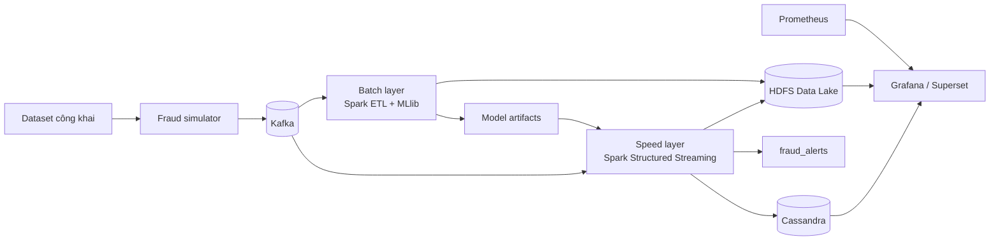

# LỚP 2026.1 - THẦY TRUNG - MÃ HỌC PHẦN IT4043E: BIG DATA STORAGE AND PROCESSING

# Online Credit-card Payment Fraud Detection

> Hệ thống phát hiện gian lận thanh toán trực tuyến gần thời gian thực theo Lambda Architecture.

## Thành viên nhóm

| MSSV | Họ và tên |
| ---: | --- |
| 202416697 | Nguyễn Minh Hoàng |
| 202416672 | Lê Trọng Đạt |
| 202416691 | Phạm Trung Hiếu |
| 202416689 | Nguyễn Trung Hiếu |
| 202416711 | Lê Xuân Nhật Khôi |

## Mục lục

- [Tổng quan](#tổng-quan)
- [Bài toán và phạm vi](#bài-toán-và-phạm-vi)
- [Kiến trúc hệ thống](#kiến-trúc-hệ-thống)
- [Dữ liệu và simulator](#dữ-liệu-và-simulator)
- [Schema, chất lượng dữ liệu và features](#schema-chất-lượng-dữ-liệu-và-features)
- [Công nghệ và hướng dẫn sử dụng](#công-nghệ-và-hướng-dẫn-sử-dụng)
- [Hướng dẫn triển khai](#hướng-dẫn-triển-khai)
- [Machine learning và đánh giá](#machine-learning-và-đánh-giá)
- [Monitoring, kiểm thử và fault tolerance](#monitoring-kiểm-thử-và-fault-tolerance)
- [Roadmap 8 tuần](#roadmap-8-tuần)
- [Phân công nhóm](#phân-công-nhóm)
- [Quy trình Git và demo](#quy-trình-git-và-demo)

---

## Tổng quan

Trong thanh toán trực tuyến, hệ thống cần đánh giá một giao dịch trong vài giây trước khi chấp nhận hoặc từ chối. Đồ án xây dựng một data pipeline nhận giao dịch dạng event stream, kết hợp lịch sử hành vi của thẻ/khách hàng/thiết bị, tạo `risk_score` rồi xuất quyết định.

```text
Ingestion (Kafka) -> Processing (Spark) -> Storage (HDFS + NoSQL) -> Visualization (Grafana/Superset)
```

Mục tiêu là minh chứng một hệ thống Big Data end-to-end với Spark batch và streaming, window aggregation, join optimization, watermark, state management, MLlib, distributed storage, NoSQL, Kubernetes và monitoring. Đây không phải hệ thống ngân hàng thật và không sử dụng dữ liệu thẻ thật.

## Bài toán và phạm vi

### Nghiệp vụ

Đầu vào là một giao dịch thanh toán online; đầu ra là một điểm rủi ro và quyết định:

| Quyết định | Ngưỡng demo | Hành động |
|---|---:|---|
| `APPROVE` | `risk_score < 40` | Chấp nhận tự động |
| `REVIEW` | `40 <= risk_score < 70` | Đưa vào hàng đợi kiểm tra |
| `BLOCK` | `risk_score >= 70` | Tạm chặn và phát alert |

Các fraud scenario cần demo:

| Scenario | Dấu hiệu chính | Features kỳ vọng |
|---|---|---|
| Card testing | Giao dịch nhỏ và thất bại liên tiếp | `failed_tx_count_10m`, `tx_count_5m` |
| Velocity fraud | Một thẻ giao dịch rất nhanh | `tx_count_5m`, `amount_sum_1h` |
| Device sharing | Một thiết bị/IP dùng nhiều thẻ | `unique_cards_per_device_1h` |
| High-value anomaly | Amount cao bất thường | `amount_vs_avg_7d` |
| New merchant/location | Merchant/quốc gia chưa có trong lịch sử | `is_new_merchant`, `is_new_country` |

### Mục tiêu hoàn thành

1. Giao dịch được phát liên tục vào Kafka.
2. PySpark Structured Streaming validate, deduplicate, xử lý late event và tính features theo event-time.
3. Raw/curated data được lưu HDFS dạng Parquet; score/alert được phục vụ bằng Cassandra.
4. Có batch job train/evaluate fraud model bằng Spark MLlib.
5. Thành phần chính chạy trên Kubernetes, không chỉ Docker đơn lẻ.
6. Có dashboard metrics, fraud alerts và một demo có thể chạy lại.

### Ngoài phạm vi

- Không kết nối ngân hàng/payment gateway thật.
- Không lưu số thẻ, CVV, tên hoặc địa chỉ thật.
- Không xử lý chargeback, KYC hay phát hành model production.

Mọi `card_id`, `device_id`, `ip` đều phải là dữ liệu giả lập hoặc hash một chiều. Không commit `.env`, secrets, dataset gốc, logs, checkpoint và model lớn lên Git.

## Kiến trúc hệ thống

### Lý do chọn Lambda Architecture

- **Speed layer** trả điểm rủi ro khi event đến.
- **Batch layer** chuẩn hóa lịch sử, backfill late data và retrain model từ fraud label đã xác nhận.
- **Serving layer** cung cấp kết quả mới nhất cho dashboard và truy vấn.



### Vai trò từng thành phần

| Thành phần | Công nghệ | Vai trò |
|---|---|---|
| Producer | Python | Phát transaction events và fraud scenarios |
| Event bus | Apache Kafka | Lưu, partition và replay event stream |
| Stream processing | Spark Structured Streaming | Validate, enrich, aggregate, score |
| Batch processing | Spark SQL + MLlib | ETL lịch sử, feature batch, training |
| Data lake | HDFS | Raw, cleaned, curated Parquet và checkpoint |
| NoSQL | Cassandra | Tra cứu risk score/alert theo thẻ và thời gian |
| Observability | Prometheus + Grafana | Metrics và dashboard |
| Orchestration | Kubernetes + Helm | Deploy, restart, scale workload |

### Luồng dữ liệu chi tiết

1. Simulator đọc dataset hoặc tạo transaction synthetic, chuẩn hóa event JSON và hash định danh.
2. Event được gửi vào `transactions_raw`; key là `card_id_hash` để event cùng thẻ có thứ tự tốt hơn.
3. Spark parse schema, gửi record sai vào `transactions_invalid`.
4. Spark dùng watermark 15 phút và `transaction_id` để xử lý event đến muộn/trùng lặp.
5. Pipeline join profile merchant/customer, tính streaming features và chạy rule/model scoring.
6. Ghi raw/curated/scored data vào HDFS; upsert kết quả mới nhất vào Cassandra.
7. Đẩy giao dịch `REVIEW`/`BLOCK` vào `fraud_alerts`.
8. Batch job tạo curated table, đánh giá metrics và publish model version mới.

### Kafka topics

| Topic | Key | Mục đích |
|---|---|---|
| `transactions_raw` | `card_id_hash` | Giao dịch chuẩn hóa đầu vào |
| `transactions_invalid` | `transaction_id` | Bản ghi sai schema/rule |
| `fraud_alerts` | `card_id_hash` | Giao dịch review/block |
| `fraud_feedback` | `transaction_id` | Fraud label xác nhận dùng cho batch retraining |

## Dữ liệu và simulator

| Dataset | Link | Cách dùng |
|---|---|---|
| IEEE-CIS Fraud Detection | [Kaggle](https://www.kaggle.com/competitions/ieee-fraud-detection/data) | EDA sâu, feature engineering, batch train/test |
| Credit Card Fraud Detection - ULB | [Kaggle](https://www.kaggle.com/datasets/mlg-ulb/creditcardfraud) | Baseline nhanh và kiểm thử local |

### Quy trình dùng dữ liệu

1. Tạo tài khoản Kaggle và tải theo điều khoản của Kaggle.
2. Lưu vào `data/raw/` và thêm thư mục này vào `.gitignore`.
3. Bắt đầu bằng ULB vì dataset nhỏ, sau đó dùng sample/IEEE-CIS cho batch processing lớn hơn.
4. Viết adapter chuyển dữ liệu nguồn về transaction schema chung, không đưa tất cả cột nguồn vào pipeline nếu không phục vụ bài toán.
5. Simulator nhận các tham số `--scenario`, `--rate`, `--duration`, `--bootstrap-server` và seed để tái lập demo.

Simulator phải phát được `normal`, `card_testing`, `velocity_fraud`, `device_sharing`, `high_value_anomaly`, cùng duplicate và late event để test.

## Schema, chất lượng dữ liệu và features

### Transaction schema

```json
{
  "transaction_id": "tx_20261004_000001",
  "event_time": "2026-10-04T09:30:00Z",
  "customer_id": "cus_00128",
  "card_id_hash": "sha256:example",
  "merchant_id": "merchant_0042",
  "amount": 1250000.0,
  "currency": "VND",
  "channel": "web",
  "device_id_hash": "sha256:example",
  "ip_hash": "sha256:example",
  "country": "VN",
  "transaction_status": "success"
}
```

### Data quality rules

| Kiểm tra | Xử lý |
|---|---|
| Thiếu `transaction_id`, `event_time`, `card_id_hash`, `amount`, `merchant_id` | Gửi invalid topic, không score |
| `amount <= 0` | Invalid record |
| `transaction_id` trùng | Bỏ duplicate trong watermark window |
| Late event <= 15 phút | Cập nhật state/window |
| Late event > 15 phút | Lưu `late_events` để batch backfill |
| Schema version không hỗ trợ | Gửi invalid topic và tăng metric |

### Features tối thiểu

| Feature | Ý nghĩa | Kỹ thuật Spark |
|---|---|---|
| `tx_count_5m` | Số giao dịch một thẻ trong 5 phút | Sliding window aggregation |
| `amount_sum_1h` | Tổng tiền một thẻ trong 1 giờ | Stateful aggregation |
| `failed_tx_count_10m` | Số giao dịch fail gần đây | Conditional aggregation |
| `unique_cards_per_device_1h` | Số thẻ trên một device | `approx_count_distinct` |
| `amount_vs_avg_7d` | Amount / trung bình lịch sử | Batch profile + broadcast join |
| `is_new_merchant` | Merchant mới với khách hàng | Lookup/anti join |
| `hour_of_day` | Giờ giao dịch | Built-in datetime function |

### Data lake layout

```text
/fraud-data/
  raw/event_date=YYYY-MM-DD/event_hour=HH/
  cleaned/event_date=YYYY-MM-DD/event_hour=HH/
  curated/event_date=YYYY-MM-DD/
  late_events/event_date=YYYY-MM-DD/
  checkpoints/streaming_scoring/
  models/model_version=<version>/
```

Raw có thể là JSON/Avro; cleaned và curated dùng Parquet + Snappy, partition theo ngày/giờ để Spark partition pruning.

## Công nghệ và hướng dẫn sử dụng

| Công cụ | Vai trò | Hướng dẫn chính thức |
|---|---|---|
| Python 3.11+ | Simulator, test, PySpark | [Python Tutorial](https://docs.python.org/3/tutorial/) |
| Apache Kafka | Event streaming | [Kafka Quickstart](https://kafka.apache.org/quickstart/) |
| Apache Spark | Batch và Structured Streaming | [Spark Streaming Guide](https://spark.apache.org/docs/latest/structured-streaming-programming-guide.html) |
| Spark MLlib | Train/evaluate model | [MLlib Guide](https://spark.apache.org/docs/latest/ml-guide.html) |
| HDFS | Distributed storage | [HDFS User Guide](https://hadoop.apache.org/docs/stable/hadoop-project-dist/hadoop-hdfs/HdfsUserGuide.html) |
| Cassandra | NoSQL serving store | [Cassandra Getting Started](https://cassandra.apache.org/doc/latest/cassandra/getting-started/) |
| Kubernetes | Orchestrate services | [Kubernetes Basics](https://kubernetes.io/docs/tutorials/kubernetes-basics/) |
| Helm | Cài workload Kubernetes | [Helm Quickstart](https://helm.sh/docs/intro/quickstart/) |
| Grafana + Prometheus | Dashboard và metrics | [Grafana Docs](https://grafana.com/docs/grafana/latest/getting-started/) |

### Vai trò kỹ thuật cần chứng minh

- Kafka: topic/partition, producer-consumer, consumer lag.
- Spark: multi-stage transformations, UDF, broadcast/sort-merge join, window, watermark, checkpoint, output mode và execution plan.
- Storage: Parquet, partitioning, compression, hot/cold data, Cassandra data model theo query.
- Kubernetes: Deployment/StatefulSet, Service, ConfigMap, Secret, resource limit, restart/self-healing.

## Hướng dẫn triển khai

### Phần mềm cần cài

```text
Git, Docker Desktop, Python 3.11+, Java 17, kubectl, Helm 3, Minikube hoặc Kind
```

Khuyến nghị macOS/Linux/WSL2. Chỉ chọn **một** cluster local là Minikube hoặc Kind cho mỗi máy.

### Clone repository

```bash
git clone https://github.com/hieunguyen-cyber/BigData_Project.git
cd BigData_Project
```

### Python environment

Sau khi nhóm thêm `requirements.txt`:

```bash
python3 -m venv .venv
source .venv/bin/activate
pip install --upgrade pip
pip install -r requirements.txt
```

Trên Windows PowerShell dùng `.venv\Scripts\Activate.ps1`.

### Kubernetes local

Ví dụ Minikube:

```bash
minikube start --cpus=4 --memory=8192
kubectl get nodes
```

Ví dụ Kind:

```bash
kind create cluster --name fraud-local
kubectl cluster-info
```

### Biến môi trường

Tạo `.env` từ `.env.example` khi repository có các file này. Không commit `.env`.

```text
KAFKA_BOOTSTRAP_SERVERS=<kafka-service>:9092
HDFS_NAMENODE_URI=hdfs://<namenode-service>:9000
CASSANDRA_HOST=<cassandra-service>
FRAUD_MODEL_URI=/fraud-data/models/model_version=v1
```

### Trình tự chạy pipeline mục tiêu

1. Tạo cluster Kubernetes.
2. Deploy Kafka, HDFS, Cassandra, Prometheus và Grafana bằng Helm/manifests.
3. Kiểm tra pods/services healthy, sau đó tạo Kafka topics.
4. Chạy batch ETL để có curated tables và model baseline.
5. Submit Spark streaming job với checkpoint path cố định.
6. Chạy simulator; mở dashboard kiểm tra traffic, lag, latency và alert.

Mỗi Spark streaming query bắt buộc có `checkpointLocation` riêng. Cần dùng `transaction_id` làm idempotency key cho các sink để retry/restart không nhân alert.

### Target structure

```text
BigData_Project/
├── data-generator/      # producer, scenarios, adapters
├── spark-jobs/          # streaming scoring, batch ETL, train, backfill
├── common/              # schema, features, rules, config
├── infra/               # Helm, Kubernetes, monitoring
├── dashboard/
├── tests/
├── docs/
├── data/                # gitignored
├── .env.example
├── requirements.txt
└── README.md
```

Đây là cấu trúc mục tiêu; mỗi thư mục được bổ sung bằng pull request có owner, hướng dẫn chạy và tests.

## Machine learning và đánh giá

### Mô hình theo giai đoạn

| Giai đoạn | Phương pháp | Mục tiêu |
|---|---|---|
| Baseline 0 | Rule-based risk scoring | Có demo end-to-end sớm, dễ giải thích |
| Model v1 | Spark MLlib Logistic Regression | Baseline supervised model |
| Model v2 | Random Forest, nếu đủ thời gian | So sánh chất lượng và trade-off |

Ví dụ rules:

```text
amount > 3 * avg_amount_7d             -> +30
tx_count_5m >= 5                        -> +35
unique_cards_per_device_1h >= 3         -> +40
failed_tx_count_10m >= 3                -> +20
```

### Nguyên tắc đánh giá

- Chia train/validation/test theo thời gian để tránh nhìn thấy tương lai.
- Không dùng `simulation_label` hoặc label tương lai làm online feature.
- Vì fraud là rare class, không dùng accuracy làm metric chính.

| Metric | Ý nghĩa |
|---|---|
| Precision | Tỷ lệ alert đúng |
| Recall | Tỷ lệ fraud thật được phát hiện |
| F1-score | Cân bằng precision/recall |
| PR-AUC | Phù hợp lớp mất cân bằng |
| False Positive Rate | Cảnh báo/chặn nhầm |
| Throughput | Events xử lý mỗi giây |
| Latency p50/p95 | Thời gian ingest đến quyết định |

## Monitoring, kiểm thử và fault tolerance

### Dashboard cần có

| Nhóm | Metrics |
|---|---|
| Kafka | Producer rate, topic throughput, consumer lag |
| Spark | Input/processed rate, batch duration, state rows, failed batches |
| Data quality | Invalid, duplicate, late events |
| Fraud | Số approve/review/block, fraud rate, alert volume |
| Storage | HDFS usage, Cassandra read/write latency |
| Kubernetes | CPU/RAM, restart count, pod status |

### Test cases tối thiểu

| Test | Kỳ vọng |
|---|---|
| Normal traffic | Phần lớn giao dịch approve |
| Card testing | Velocity/failure feature tăng và tạo review/block |
| Duplicate | Một kết quả cuối theo `transaction_id` |
| Late event trong watermark | Được tính vào state/window |
| Late event quá watermark | Ghi `late_events` để backfill |
| Spark restart | Phục hồi checkpoint, không mất/nhân alert |
| Consumer chậm | Dashboard cho thấy Kafka lag |

Tuning cần báo cáo: partition Kafka/Spark, broadcast join, sort-merge join, Parquet partition pruning, cache/persist, micro-batch size, executor resources và `explain()` trước/sau tối ưu.

## Roadmap 8 tuần

| Tuần | Mục tiêu | Deliverable |
|---|---|---|
| 1 | Chốt scope và thiết kế | Proposal, Lambda diagram, schema, data dictionary, GitHub Issues |
| 2 | Hiểu data và simulator | EDA, quality rules, adapter, producer với 5 scenarios |
| 3 | Hạ tầng nền | K8s local, Kafka/HDFS/Cassandra, environment guide |
| 4 | Batch pipeline | Raw -> cleaned -> curated Parquet, joins/aggregations, quality report |
| 5 | ML baseline | Feature v1, Logistic Regression, metrics, model artifact |
| 6 | Streaming scoring | Watermark, dedup, stateful windows, Kafka -> HDFS/Cassandra/alerts |
| 7 | Quan sát và tối ưu | Dashboard, metrics, benchmark, tuning report |
| 8 | Bàn giao | Recovery test, report, slides, demo script, video |

Kiểm soát tiến độ: cuối tuần 2 phải có event Kafka; cuối tuần 4 có curated Parquet; cuối tuần 6 demo fraud end-to-end; cuối tuần 8 bất kỳ thành viên nào cũng chạy lại được demo theo README.

## Phân công nhóm

| Thành viên | Vai trò | Deliverable chính |
|---|---|---|
| Nguyễn Minh Hoàng | Tech lead & Data engineer | Architecture, schema, simulator, Kafka topics, integration README |
| Lê Trọng Đạt | Spark batch & storage engineer | HDFS, Parquet, batch ETL, joins, partition tuning |
| Phạm Trung Hiếu | ML engineer | EDA, features, MLlib, model evaluation |
| Nguyễn Trung Hiếu | Streaming engineer | Structured Streaming, state/watermark/checkpoint, online scoring |
| Lê Xuân Nhật Khôi | DevOps, monitoring & reporting lead | Kubernetes, Cassandra, Grafana, CI, dashboard, demo/report |

| Tuần | Hoàng | Đạt | Phạm Trung Hiếu | Nguyễn Trung Hiếu | Nhật Khôi |
|---|---|---|---|---|---|
| 1 | Architecture/schema | Storage design | EDA plan | Streaming design | Repo/backlog/K8s plan |
| 2 | Simulator v1 | Dataset ingestion | EDA/label analysis | Consumer prototype | Local environment guide |
| 3 | Kafka config | HDFS deploy | Baseline notebook | Spark-Kafka prototype | Helm/K8s deployment |
| 4 | Quality integration | Batch ETL | Feature spec | Streaming feature prototype | Cassandra schema |
| 5 | Scenarios | Batch tuning | Train/evaluate | Model loading | Model deployment |
| 6 | Integration tests | Curated sink | Score validation | Streaming scoring | Dashboard v1 |
| 7 | Load test | Partition tuning | Error analysis | State tuning | Monitoring/CI |
| 8 | Demo coordination | Storage evidence | ML evidence | Recovery evidence | Report/slides/video |

Mỗi người review ít nhất một PR của người khác và chuẩn bị được phần phụ trách trong buổi bảo vệ.

## Quy trình Git và demo

1. Mọi task trên 2 giờ có GitHub Issue với owner và acceptance criteria.
2. Không commit trực tiếp vào `main`; dùng `feature/<short-name>` hoặc `fix/<short-name>`.
3. PR phải ghi mục đích, cách chạy, tests đã thực hiện và ảnh hưởng pipeline.
4. Merge sau tối thiểu một review; tạo tag cuối tuần, ví dụ `week-04-batch-pipeline`.
5. Họp kỹ thuật hai lần/tuần, 20-30 phút: demo thay đổi, blocker và kế hoạch kế tiếp.

### Kịch bản demo cuối kỳ

1. Khởi động cluster, xác nhận Kafka/Spark/HDFS/Cassandra healthy.
2. Chạy normal traffic; dashboard cho thấy phần lớn `APPROVE`.
3. Chuyển sang `card_testing` hoặc `velocity_fraud`.
4. Theo dõi features bất thường, `risk_score`, alert trong Cassandra/Kafka/dashboard.
5. Cho Spark streaming pod restart; xác nhận recovery từ checkpoint và alert không trùng.
6. Trình bày batch report với Precision, Recall, F1, PR-AUC và ít nhất một tối ưu hiệu năng.

## Rủi ro và hướng phát triển

| Rủi ro | Giảm thiểu |
|---|---|
| Máy không đủ tài nguyên | Cluster nhỏ, sample data, deploy theo lớp |
| Dataset schema khác nhau | Adapter + schema chuẩn |
| Fraud mất cân bằng | Class weighting/sampling, dùng PR-AUC |
| Streaming state quá lớn | Watermark, TTL, theo dõi state metrics |
| Retry gây duplicate | Idempotency bằng `transaction_id` |
| Demo phụ thuộc hạ tầng | Checklist, seed cố định, scripts, fallback local |

Hướng phát triển: tự động retrain khi concept drift, feature store cho online/offline features, graph analysis để phát hiện fraud ring, model explainability, RBAC/secret management/encryption/audit logging đầy đủ hơn.

## Tài liệu tham khảo

- [Apache Kafka Documentation](https://kafka.apache.org/documentation/)
- [Apache Spark Documentation](https://spark.apache.org/docs/latest/)
- [Apache Hadoop Documentation](https://hadoop.apache.org/docs/)
- [Apache Cassandra Documentation](https://cassandra.apache.org/doc/latest/)
- [Kubernetes Documentation](https://kubernetes.io/docs/)
- [Grafana Documentation](https://grafana.com/docs/)
