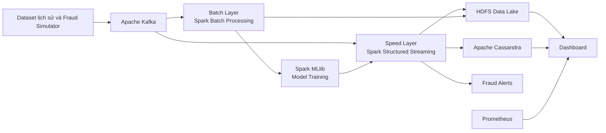

# LỚP 2026.1 - THẦY TRUNG - MÃ HỌC PHẦN IT4043E: BIG DATA STORAGE AND PROCESSING

# FraudStream - Real-Time Online Payment Fraud Detection

> Hệ thống phát hiện gian lận giao dịch thanh toán trực tuyến theo thời gian thực, xây dựng theo Lambda Architecture.

## Thành viên nhóm

| MSSV | Họ và tên |
| ---: | --- |
| 202416697 | Nguyễn Minh Hoàng |
| 202416672 | Lê Trọng Đạt |
| 202416691 | Phạm Trung Hiếu |
| 202416689 | Nguyễn Trung Hiếu |
| 202416711 | Lê Xuân Nhật Khôi |

## 1. Giới thiệu dự án

FraudStream là hệ thống phân tích dữ liệu lớn nhằm nhận biết sớm các giao dịch thanh toán trực tuyến có dấu hiệu gian lận. Hệ thống tiếp nhận giao dịch dưới dạng dòng sự kiện, phân tích hành vi của thẻ, khách hàng, thiết bị và merchant, sau đó tính điểm rủi ro cho từng giao dịch.

Kết quả dự kiến gồm ba mức quyết định:

| Quyết định | Ý nghĩa |
|---|---|
| `APPROVE` | Giao dịch có rủi ro thấp, được chấp nhận |
| `REVIEW` | Giao dịch đáng ngờ, cần kiểm tra thêm |
| `BLOCK` | Giao dịch có nguy cơ cao, cần tạm chặn |

## 2. Bài toán cần giải quyết

Gian lận thanh toán trực tuyến thường xuất hiện dưới nhiều hình thức:

- Một thẻ tạo nhiều giao dịch trong thời gian ngắn.
- Nhiều giao dịch giá trị nhỏ thất bại liên tiếp trước một giao dịch thành công.
- Giá trị giao dịch cao bất thường so với lịch sử chủ thẻ.
- Một thiết bị hoặc IP được sử dụng cho nhiều thẻ khác nhau.
- Giao dịch phát sinh tại merchant, quốc gia hoặc khung giờ không quen thuộc.

Hệ thống tập trung vào việc xử lý những tín hiệu này gần thời gian thực, đồng thời lưu dữ liệu lịch sử để phân tích, đánh giá và cải thiện mô hình.

## 3. Mục tiêu

1. Xây dựng data pipeline hoàn chỉnh: **ingestion -> processing -> storage -> visualization**.
2. Tiếp nhận giao dịch liên tục qua message queue.
3. Xử lý batch và streaming bằng Apache Spark.
4. Tính các đặc trưng hành vi theo cửa sổ thời gian.
5. Xây dựng mô hình/rule engine tạo điểm rủi ro fraud.
6. Lưu dữ liệu trên distributed storage và NoSQL database.
7. Trực quan hóa giao dịch, fraud alert và chỉ số vận hành.
8. Triển khai các thành phần trong môi trường Kubernetes.

## 4. Kiến trúc dự kiến

Hệ thống sử dụng **Lambda Architecture** để kết hợp xử lý thời gian thực và xử lý dữ liệu lịch sử.



### Vai trò các thành phần

| Thành phần | Vai trò |
|---|---|
| Kafka | Nhận, lưu đệm và phân phối dòng giao dịch |
| Spark Structured Streaming | Làm sạch dữ liệu, tính feature và chấm điểm online |
| Spark Batch | ETL dữ liệu lịch sử, phân tích và huấn luyện mô hình |
| HDFS | Lưu raw data, cleaned data và curated data |
| Cassandra | Lưu risk score và fraud alert để truy vấn nhanh |
| Spark MLlib | Huấn luyện và đánh giá mô hình fraud detection |
| Prometheus + Grafana | Thu thập metrics và trực quan hóa vận hành |
| Kubernetes | Triển khai, quản lý và mở rộng các dịch vụ |

## 5. Luồng xử lý dữ liệu

1. Fraud simulator phát sự kiện giao dịch vào Kafka.
2. Spark Streaming đọc giao dịch, kiểm tra schema và loại bỏ bản ghi trùng lặp.
3. Pipeline xử lý dữ liệu đến muộn bằng watermark và quản lý trạng thái theo event time.
4. Spark tính các feature hành vi của thẻ, khách hàng, merchant và thiết bị.
5. Rule engine hoặc mô hình ML tạo `risk_score` và quyết định `APPROVE`, `REVIEW` hoặc `BLOCK`.
6. Dữ liệu được lưu vào HDFS theo định dạng Parquet; score và alert được ghi vào Cassandra.
7. Dashboard hiển thị fraud alerts, throughput, latency, Kafka lag và chất lượng dữ liệu.
8. Batch layer phân tích dữ liệu lịch sử và cập nhật mô hình fraud detection.

### Kafka topics

| Topic | Nội dung |
|---|---|
| `transactions_raw` | Giao dịch đầu vào từ simulator |
| `transactions_invalid` | Bản ghi không đạt yêu cầu chất lượng |
| `fraud_alerts` | Giao dịch có mức `REVIEW` hoặc `BLOCK` |
| `fraud_feedback` | Nhãn fraud phục vụ phân tích và huấn luyện |

## 6. Dữ liệu và fraud scenarios

### Nguồn dữ liệu

| Dataset | Link | Mục đích |
|---|---|---|
| IEEE-CIS Fraud Detection | [Kaggle](https://www.kaggle.com/competitions/ieee-fraud-detection/data) | Phân tích dữ liệu, feature engineering, batch train/test |
| Credit Card Fraud Detection - ULB | [Kaggle](https://www.kaggle.com/datasets/mlg-ulb/creditcardfraud) | Baseline model và kiểm thử pipeline |

### Fraud simulator

Simulator tạo dữ liệu giao dịch theo schema chuẩn và phát vào Kafka với tốc độ có thể cấu hình. Các kịch bản bao gồm:

| Kịch bản | Mô tả |
|---|---|
| Normal traffic | Hành vi giao dịch thông thường |
| Card testing | Nhiều giao dịch nhỏ, thất bại liên tiếp |
| Velocity fraud | Một thẻ giao dịch nhiều lần trong thời gian ngắn |
| Device sharing | Một thiết bị/IP được dùng với nhiều thẻ |
| High-value anomaly | Giao dịch có giá trị cao bất thường |

## 7. Thiết kế dữ liệu và feature engineering

Mỗi giao dịch được chuẩn hóa theo schema sau:

```json
{
  "transaction_id": "tx_20261004_000001",
  "event_time": "2026-10-04T09:30:00Z",
  "customer_id": "cus_00128",
  "card_id_hash": "sha256:...",
  "merchant_id": "merchant_0042",
  "amount": 1250000.0,
  "currency": "VND",
  "channel": "web",
  "device_id_hash": "sha256:...",
  "ip_hash": "sha256:...",
  "country": "VN",
  "transaction_status": "success"
}
```

Các định danh nhạy cảm đều được giả lập hoặc băm.

| Feature | Ý nghĩa |
|---|---|
| `tx_count_5m` | Số giao dịch của một thẻ trong 5 phút |
| `amount_sum_1h` | Tổng giá trị giao dịch trong 1 giờ |
| `failed_tx_count_10m` | Số giao dịch thất bại trong 10 phút |
| `unique_cards_per_device_1h` | Số thẻ dùng cùng một thiết bị trong 1 giờ |
| `amount_vs_avg_7d` | Tỷ lệ giá trị hiện tại so với mức trung bình 7 ngày |
| `is_new_merchant` | Merchant mới với khách hàng |
| `is_new_country` | Quốc gia mới với khách hàng |

Data lake lưu dữ liệu theo các lớp `raw`, `cleaned`, `curated`, `late_events` và `models`; dữ liệu phân tích sử dụng Parquet nén Snappy, partition theo ngày/giờ.

## 8. Công cụ sử dụng

| Công cụ | Vai trò | Hướng dẫn |
|---|---|---|
| Python 3.11+ | Simulator, PySpark jobs, kiểm thử | [Python Tutorial](https://docs.python.org/3/tutorial/) |
| Apache Kafka | Distributed event streaming | [Kafka Quickstart](https://kafka.apache.org/quickstart/) |
| Apache Spark | Batch, Structured Streaming và SQL | [Spark Documentation](https://spark.apache.org/docs/latest/) |
| Spark MLlib | Huấn luyện và đánh giá model | [Spark MLlib Guide](https://spark.apache.org/docs/latest/ml-guide.html) |
| HDFS | Distributed file storage | [HDFS User Guide](https://hadoop.apache.org/docs/stable/hadoop-project-dist/hadoop-hdfs/HdfsUserGuide.html) |
| Apache Cassandra | NoSQL serving database | [Cassandra Documentation](https://cassandra.apache.org/doc/latest/) |
| Kubernetes | Điều phối các workload | [Kubernetes Basics](https://kubernetes.io/docs/tutorials/kubernetes-basics/) |
| Helm | Quản lý package Kubernetes | [Helm Quickstart](https://helm.sh/docs/intro/quickstart/) |
| Prometheus + Grafana | Metrics, alert và dashboard | [Grafana Documentation](https://grafana.com/docs/grafana/latest/) |
| GitHub | Version control, issues và pull requests | [GitHub Flow](https://docs.github.com/en/get-started/using-github/github-flow) |

## 9. Môi trường chuẩn của nhóm

Repository lấy môi trường phát triển hiện có trên máy trưởng nhóm làm mốc thống nhất. Mọi thay đổi về Python packages hoặc công cụ chạy dự án phải được cập nhật đồng thời trong `requirements.txt` và mục này của README.

| Hạng mục | Phiên bản mốc |
|---|---|
| Python | 3.12.7 |
| Java / OpenJDK | 25.0.1 |
| Git | 2.50.1 |
| Docker Desktop | 27.5.1 |
| NumPy | 1.26.4 |
| pandas | 2.3.3 |
| scikit-learn | 1.4.2 |
| pytest | 7.4.4 |
| python-dotenv | 1.0.1 |
| PyYAML | 6.0.1 |
| requests | 2.32.3 |
| Ruff | 0.11.8 |

Các dịch vụ Big Data như Kafka, HDFS, Cassandra, Spark cluster, Kubernetes và Grafana được quản lý bằng container/Kubernetes thay vì cài Python package tương ứng. `requirements.txt` chỉ quản lý dependencies của mã Python trong repository.

## 10. Yêu cầu kỹ thuật chính

### Spark

- Window functions và complex aggregations.
- Chuỗi transformations, UDF và business rules.
- Broadcast join với profile nhỏ; sort-merge join với dataset lớn.
- Partition pruning, caching, persistence và execution-plan analysis.
- Structured Streaming với output modes, watermark, state management và checkpoint.
- MLlib cho supervised fraud classification.

### Streaming và storage

- Dùng `transaction_id` để deduplicate và đảm bảo idempotency.
- Dùng event-time watermark để xử lý late-arriving data.
- Lưu curated data dạng Parquet, partition theo `event_date` và `event_hour`.
- Thiết kế Cassandra theo các truy vấn chính: tra cứu score/alert theo thẻ và thời gian.

### Monitoring

- Kafka producer rate, consumer lag và topic throughput.
- Spark input rate, processed rate, batch duration và state size.
- Số transaction invalid, duplicate và late.
- Số giao dịch theo `APPROVE`, `REVIEW`, `BLOCK`.
- CPU, memory, restart count và trạng thái pod trên Kubernetes.

## 11. Đánh giá mô hình

Mô hình khởi đầu là Logistic Regression trong Spark MLlib, kết hợp rule-based scoring để so sánh. Khi phù hợp, nhóm đánh giá thêm Random Forest.

Fraud là bài toán mất cân bằng nhãn, vì vậy các chỉ số đánh giá chính gồm:

| Chỉ số | Ý nghĩa |
|---|---|
| Precision | Tỷ lệ alert thực sự là fraud |
| Recall | Tỷ lệ fraud thực tế được phát hiện |
| F1-score | Cân bằng giữa precision và recall |
| PR-AUC | Hiệu quả phân loại với lớp fraud hiếm |
| False Positive Rate | Mức cảnh báo hoặc chặn nhầm |
| Throughput | Số events xử lý mỗi giây |
| Latency p50/p95 | Độ trễ từ ingest đến quyết định |

## 12. Roadmap 8 tuần

| Tuần | Mục tiêu | Kết quả |
|---|---|---|
| 1 | Phân tích bài toán và thiết kế | Proposal, architecture, schema, backlog |
| 2 | EDA và fraud simulator | Data understanding, simulator, quality rules |
| 3 | Hạ tầng nền | Kubernetes, Kafka, HDFS, Cassandra |
| 4 | Batch data pipeline | Raw -> cleaned -> curated Parquet |
| 5 | Machine learning baseline | Feature set, model, evaluation metrics |
| 6 | Streaming fraud scoring | Watermark, dedup, feature windows, alerts |
| 7 | Dashboard và tối ưu | Monitoring, benchmark, performance tuning |
| 8 | Hoàn thiện sản phẩm | Testing, report, slides, demo video |

## 13. Phân công nhóm

| Thành viên | Vai trò | Công việc chính |
|---|---|---|
| Lê Trọng Đạt | Tech lead & Data engineer | Architecture, transaction schema, simulator, Kafka, tích hợp pipeline |
| Nguyễn Minh Hoàng| Spark batch & storage engineer | HDFS, Parquet, batch ETL, joins, partitioning, storage optimization |
| Phạm Trung Hiếu | ML engineer | EDA, feature engineering, MLlib, model evaluation |
| Nguyễn Trung Hiếu | Streaming engineer | Structured Streaming, watermark, checkpoint, state management, online scoring |
| Lê Xuân Nhật Khôi | DevOps & monitoring lead | Kubernetes, Cassandra, Grafana, CI, dashboard, report/demo coordination |

Mỗi thành viên review ít nhất một pull request của thành viên khác và nắm được luồng dữ liệu end-to-end.

## 14. Quy trình làm việc

1. Quản lý công việc bằng GitHub Issues, có owner và tiêu chí hoàn thành.
2. Phát triển trên nhánh `feature/<short-name>` hoặc `fix/<short-name>`.
3. Mỗi pull request mô tả mục tiêu, cách chạy và kết quả kiểm thử.
4. Review code trước khi merge vào `main`.
5. Họp kỹ thuật hai lần mỗi tuần để cập nhật tiến độ, demo và giải quyết blocker.
6. Tag bản demo cuối mỗi tuần để lưu lại mốc phát triển.

## 15. Kịch bản demo

1. Khởi động các dịch vụ trên Kubernetes và mở dashboard.
2. Phát normal traffic từ simulator; quan sát throughput và latency.
3. Chuyển simulator sang card testing hoặc velocity fraud.
4. Quan sát feature bất thường, risk score và fraud alert.
5. Theo dõi alert trong Cassandra, Kafka và dashboard.
6. Kiểm tra cơ chế checkpoint/recovery của Spark Streaming.
7. Trình bày batch analytics, model metrics và kết quả tối ưu hiệu năng.

## 16. Hướng phát triển

- Tự động retraining khi mô hình có dấu hiệu concept drift.
- Feature store thống nhất feature batch và streaming.
- Graph analysis để nhận diện fraud ring giữa card, device, IP và merchant.
- Model explainability cho từng fraud alert.
- RBAC, secrets management, encryption và audit log đầy đủ hơn.

## Tài liệu tham khảo

- [Apache Kafka Documentation](https://kafka.apache.org/documentation/)
- [Apache Spark Documentation](https://spark.apache.org/docs/latest/)
- [Apache Hadoop Documentation](https://hadoop.apache.org/docs/)
- [Apache Cassandra Documentation](https://cassandra.apache.org/doc/latest/)
- [Kubernetes Documentation](https://kubernetes.io/docs/)
- [Grafana Documentation](https://grafana.com/docs/)
